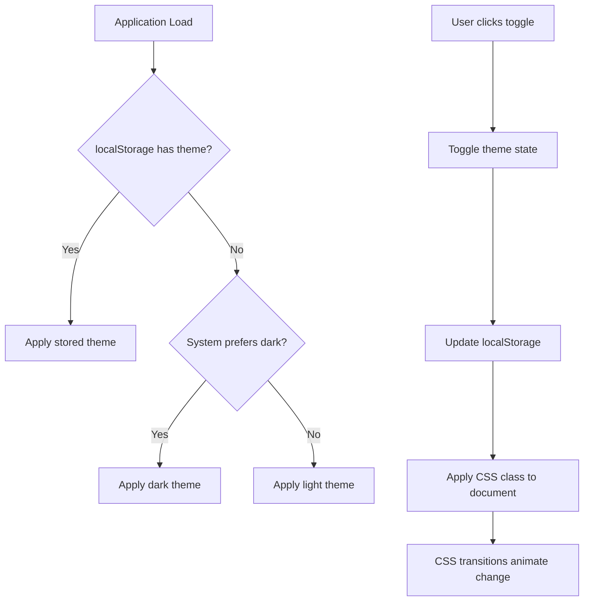

# Design Document: Dark Mode Feature

## Overview

This design implements a dark mode feature for the AWS Amplify Gen2 todo application. The solution provides users with the ability to toggle between light and dark visual themes, with automatic system theme detection and persistent preference storage.

The implementation leverages Tailwind CSS v4's native theming capabilities combined with React's Context API for state management. The design prioritizes accessibility, smooth transitions, and comprehensive theme coverage across all UI components including the Amplify Authenticator.

### Key Design Decisions

1. **CSS-based theming with Tailwind v4**: Use Tailwind's `@theme` directive with CSS custom properties for color tokens, enabling dynamic theme switching without JavaScript-heavy solutions
2. **React Context for theme state**: Centralize theme management in a ThemeProvider component that wraps the application
3. **localStorage for persistence**: Store user preference in browser localStorage with a simple key-value approach
4. **prefers-color-scheme for system detection**: Use CSS media query to detect and respect system theme preferences
5. **CSS transitions for smooth changes**: Apply 300ms transitions to color properties for pleasant visual feedback

## Architecture

### Component Structure

```
App Root (main.tsx)
├── ThemeProvider (new)
│   └── Authenticator
│       └── App
│           ├── Header (with ThemeToggle)
│           └── TodoList
```

### Theme Management Flow



### Data Flow

1. **Initialization**: ThemeProvider reads from localStorage → falls back to system preference → applies theme class to `<html>` element
2. **User Toggle**: User clicks toggle → ThemeProvider updates state → saves to localStorage → updates `<html>` class
3. **System Change**: Media query listener detects system theme change → only applies if no user preference exists

## Components and Interfaces

### ThemeProvider Component

**Purpose**: Manages theme state and provides theme context to the application

**Location**: `src/contexts/ThemeContext.tsx`

**Interface**:
```typescript
interface ThemeContextType {
  theme: 'light' | 'dark';
  toggleTheme: () => void;
}

interface ThemeProviderProps {
  children: React.ReactNode;
}
```

**Responsibilities**:
- Detect initial theme (localStorage → system preference → default to light)
- Provide theme state and toggle function via React Context
- Apply theme class to `<html>` element
- Persist theme changes to localStorage
- Listen for system theme changes (only when no user preference exists)

**Key Implementation Details**:
- Uses `useState` for theme state
- Uses `useEffect` to apply theme class to `document.documentElement`
- Uses `useEffect` with `matchMedia` to listen for system theme changes
- Stores preference in localStorage with key `theme-preference`

### ThemeToggle Component

**Purpose**: Provides UI control for switching themes

**Location**: `src/components/ThemeToggle.tsx`

**Interface**:
```typescript
interface ThemeToggleProps {
  className?: string;
}
```

**Responsibilities**:
- Display current theme state with appropriate icon
- Handle click events to toggle theme
- Support keyboard navigation (button element)
- Provide accessible label for screen readers

**Visual Design**:
- Icon-based button (sun icon for light mode, moon icon for dark mode)
- Circular button with hover state
- Positioned in application header
- Size: 40x40px with 20px icon

### useTheme Hook

**Purpose**: Provides convenient access to theme context

**Location**: `src/contexts/ThemeContext.tsx`

**Interface**:
```typescript
function useTheme(): ThemeContextType
```

**Usage**:
```typescript
const { theme, toggleTheme } = useTheme();
```

## Data Models

### Theme Preference Storage

**Storage Mechanism**: Browser localStorage

**Key**: `theme-preference`

**Value**: `"light"` | `"dark"` | `null` (null indicates no user preference)

**Schema**:
```typescript
type ThemePreference = 'light' | 'dark' | null;

// Storage operations
const getStoredTheme = (): ThemePreference => {
  const stored = localStorage.getItem('theme-preference');
  return stored === 'light' || stored === 'dark' ? stored : null;
};

const setStoredTheme = (theme: 'light' | 'dark'): void => {
  localStorage.setItem('theme-preference', theme);
};

const clearStoredTheme = (): void => {
  localStorage.removeItem('theme-preference');
};
```

### System Theme Detection

**Mechanism**: CSS Media Query via JavaScript

**Implementation**:
```typescript
const getSystemTheme = (): 'light' | 'dark' => {
  return window.matchMedia('(prefers-color-scheme: dark)').matches 
    ? 'dark' 
    : 'light';
};

const listenToSystemTheme = (callback: (theme: 'light' | 'dark') => void) => {
  const mediaQuery = window.matchMedia('(prefers-color-scheme: dark)');
  const handler = (e: MediaQueryListEvent) => {
    callback(e.matches ? 'dark' : 'light');
  };
  mediaQuery.addEventListener('change', handler);
  return () => mediaQuery.removeEventListener('change', handler);
};
```

### CSS Theme Tokens

**Location**: `src/index.css`

**Structure**:
```css
@theme {
  /* Light theme (default) */
  --color-primary: #047d95;
  --color-primary-dark: #036b80;
  --color-bg-primary: #f8fafc;
  --color-bg-secondary: #ffffff;
  --color-text-primary: #1f2937;
  --color-text-secondary: #6b7280;
  --color-border: #e5e7eb;
}

.dark {
  /* Dark theme overrides */
  --color-primary: #06b6d4;
  --color-primary-dark: #0891b2;
  --color-bg-primary: #0f172a;
  --color-bg-secondary: #1e293b;
  --color-text-primary: #f1f5f9;
  --color-text-secondary: #cbd5e1;
  --color-border: #334155;
}
```

**Token Categories**:
- **Primary colors**: Brand colors for buttons and interactive elements
- **Background colors**: Surface colors for body and cards
- **Text colors**: Foreground colors for content
- **Border colors**: Divider and outline colors


## Correctness Properties

*A property is a characteristic or behavior that should hold true across all valid executions of a system—essentially, a formal statement about what the system should do. Properties serve as the bridge between human-readable specifications and machine-verifiable correctness guarantees.*

### Property Reflection

After analyzing all acceptance criteria, I identified the following redundancies:
- Criteria 5.2 duplicates 2.4 (both test fallback to system theme when no preference exists)
- Criteria 3.1-3.4 and 4.1-4.4 are specific examples of theme application that can be consolidated
- Many criteria test UI rendering which are better suited as examples rather than properties

The following properties represent the unique, testable behaviors:

### Property 1: Theme Toggle Icon Consistency

*For any* theme state (light or dark), the theme toggle component should display an icon that correctly indicates the current theme.

**Validates: Requirements 1.3**

### Property 2: Theme Persistence Round Trip

*For any* theme selection (light or dark), selecting a theme and then reloading the application should result in the same theme being active.

**Validates: Requirements 2.1, 2.3**

### Property 3: Stored Preference Overrides System Theme

*For any* stored theme preference, the application should apply the stored preference regardless of the system theme setting.

**Validates: Requirements 2.3, 5.3**

### Property 4: System Theme Change Conditional Update

*For any* system theme change event, the application theme should update only when no explicit user preference exists in localStorage.

**Validates: Requirements 5.3**

## Error Handling

### localStorage Errors

**Scenario**: localStorage is unavailable or quota exceeded

**Handling**:
- Wrap all localStorage operations in try-catch blocks
- Fall back to in-memory state if localStorage fails
- Log errors to console for debugging
- Continue functioning with session-only theme persistence

**Implementation**:
```typescript
const safeLocalStorage = {
  getItem: (key: string): string | null => {
    try {
      return localStorage.getItem(key);
    } catch (error) {
      console.error('localStorage.getItem failed:', error);
      return null;
    }
  },
  setItem: (key: string, value: string): void => {
    try {
      localStorage.setItem(key, value);
    } catch (error) {
      console.error('localStorage.setItem failed:', error);
    }
  }
};
```

### matchMedia Unsupported

**Scenario**: Browser doesn't support matchMedia API

**Handling**:
- Check for matchMedia existence before using
- Default to light theme if unavailable
- Skip system theme listener setup

**Implementation**:
```typescript
const getSystemTheme = (): 'light' | 'dark' => {
  if (typeof window === 'undefined' || !window.matchMedia) {
    return 'light';
  }
  return window.matchMedia('(prefers-color-scheme: dark)').matches 
    ? 'dark' 
    : 'light';
};
```

### Invalid Stored Theme Value

**Scenario**: localStorage contains corrupted or invalid theme value

**Handling**:
- Validate stored value before using
- Treat invalid values as if no preference exists
- Fall back to system theme detection

**Implementation**:
```typescript
const getStoredTheme = (): 'light' | 'dark' | null => {
  const stored = safeLocalStorage.getItem('theme-preference');
  if (stored === 'light' || stored === 'dark') {
    return stored;
  }
  return null; // Invalid or missing value
};
```

### SSR/Hydration Considerations

**Scenario**: Server-side rendering or hydration mismatches

**Handling**:
- Not applicable for this Vite-based SPA
- If SSR is added later, use `useEffect` to apply theme only on client
- Avoid theme-dependent rendering in initial HTML

## Testing Strategy

### Dual Testing Approach

This feature requires both unit tests and property-based tests for comprehensive coverage:

- **Unit tests**: Verify specific examples, edge cases, and component rendering
- **Property tests**: Verify universal properties across all inputs

### Unit Testing

**Framework**: Vitest with React Testing Library

**Test Files**:
- `src/contexts/ThemeContext.test.tsx` - ThemeProvider logic
- `src/components/ThemeToggle.test.tsx` - Toggle component rendering and interaction

**Unit Test Coverage**:

1. **ThemeProvider Initialization**
   - Renders without crashing
   - Applies stored theme from localStorage on mount
   - Falls back to system theme when no stored preference
   - Defaults to light theme when matchMedia unavailable

2. **Theme Toggle Functionality**
   - Clicking toggle switches from light to dark
   - Clicking toggle switches from dark to light
   - Toggle updates localStorage on change
   - Toggle applies correct class to document.documentElement

3. **ThemeToggle Component**
   - Renders sun icon in light mode
   - Renders moon icon in dark mode
   - Button is keyboard accessible (can be focused and activated)
   - Has appropriate aria-label for screen readers

4. **System Theme Detection**
   - Detects dark system preference correctly
   - Detects light system preference correctly
   - Listens for system theme changes
   - Ignores system changes when user preference exists

5. **Error Handling**
   - Handles localStorage unavailable gracefully
   - Handles localStorage quota exceeded
   - Handles invalid stored theme values
   - Handles missing matchMedia API

6. **Edge Cases**
   - Empty localStorage
   - Corrupted localStorage data
   - Rapid toggle clicks
   - Theme change during component unmount

### Property-Based Testing

**Framework**: fast-check (JavaScript property-based testing library)

**Configuration**: Minimum 100 iterations per property test

**Test File**: `src/contexts/ThemeContext.property.test.tsx`

**Property Test Coverage**:

1. **Property 1: Theme Toggle Icon Consistency**
   - **Tag**: Feature: dark-mode, Property 1: For any theme state (light or dark), the theme toggle component should display an icon that correctly indicates the current theme
   - **Generator**: Arbitrary theme state ('light' | 'dark')
   - **Test**: Render ThemeToggle with each theme, verify correct icon is displayed
   - **Assertion**: Icon matches theme state

2. **Property 2: Theme Persistence Round Trip**
   - **Tag**: Feature: dark-mode, Property 2: For any theme selection (light or dark), selecting a theme and then reloading the application should result in the same theme being active
   - **Generator**: Arbitrary theme selection ('light' | 'dark')
   - **Test**: Set theme, save to localStorage, create new ThemeProvider instance, verify theme matches
   - **Assertion**: Initial theme === reloaded theme

3. **Property 3: Stored Preference Overrides System Theme**
   - **Tag**: Feature: dark-mode, Property 3: For any stored theme preference, the application should apply the stored preference regardless of the system theme setting
   - **Generator**: Arbitrary combinations of stored preference and system theme
   - **Test**: Mock system theme, set stored preference, initialize ThemeProvider, verify stored preference is used
   - **Assertion**: Applied theme === stored preference (not system theme)

4. **Property 4: System Theme Change Conditional Update**
   - **Tag**: Feature: dark-mode, Property 4: For any system theme change event, the application theme should update only when no explicit user preference exists in localStorage
   - **Generator**: Arbitrary system theme changes with/without stored preference
   - **Test**: Initialize ThemeProvider, trigger system theme change event, verify theme updates only when no stored preference
   - **Assertion**: Theme updates ⟺ no stored preference

**Property Test Example**:
```typescript
import fc from 'fast-check';
import { render } from '@testing-library/react';
import { ThemeProvider, useTheme } from './ThemeContext';

describe('Property Tests', () => {
  it('Property 2: Theme Persistence Round Trip', () => {
    // Feature: dark-mode, Property 2: For any theme selection (light or dark), 
    // selecting a theme and then reloading the application should result in 
    // the same theme being active
    
    fc.assert(
      fc.property(
        fc.constantFrom('light' as const, 'dark' as const),
        (selectedTheme) => {
          // Clear localStorage
          localStorage.clear();
          
          // First render: set theme
          const { unmount } = render(
            <ThemeProvider>
              <TestComponent initialTheme={selectedTheme} />
            </ThemeProvider>
          );
          unmount();
          
          // Second render: verify persistence
          let appliedTheme: string | null = null;
          const TestReader = () => {
            const { theme } = useTheme();
            appliedTheme = theme;
            return null;
          };
          
          render(
            <ThemeProvider>
              <TestReader />
            </ThemeProvider>
          );
          
          return appliedTheme === selectedTheme;
        }
      ),
      { numRuns: 100 }
    );
  });
});
```

### Integration Testing

**Scope**: Verify theme application across all components

**Test Scenarios**:
1. Theme toggle affects App component styling
2. Theme toggle affects Authenticator component styling
3. Theme persists across sign out/sign in
4. Theme applies to dynamically created todo items

### Visual Regression Testing

**Recommendation**: Use Playwright or Chromatic for visual testing

**Test Cases**:
1. Light theme screenshot of entire app
2. Dark theme screenshot of entire app
3. Light theme screenshot of Authenticator
4. Dark theme screenshot of Authenticator
5. Theme transition animation (if feasible)

### Accessibility Testing

**Tools**: axe-core, WAVE, manual keyboard testing

**Test Cases**:
1. Theme toggle is keyboard accessible (Tab, Enter, Space)
2. Theme toggle has appropriate ARIA labels
3. Color contrast ratios meet WCAG AA standards in both themes
4. Focus indicators are visible in both themes
5. Screen reader announces theme changes appropriately

### Manual Testing Checklist

- [ ] Toggle switches theme immediately
- [ ] Theme persists after page reload
- [ ] Theme persists after browser restart
- [ ] System theme is detected on first visit
- [ ] System theme changes are ignored when user has set preference
- [ ] All components (auth, todos, buttons, inputs) update with theme
- [ ] Transitions are smooth (300ms)
- [ ] No layout shifts during theme change
- [ ] Works in Chrome, Firefox, Safari, Edge
- [ ] Works on mobile devices
- [ ] Works with browser extensions that modify colors
- [ ] localStorage errors don't break the app

